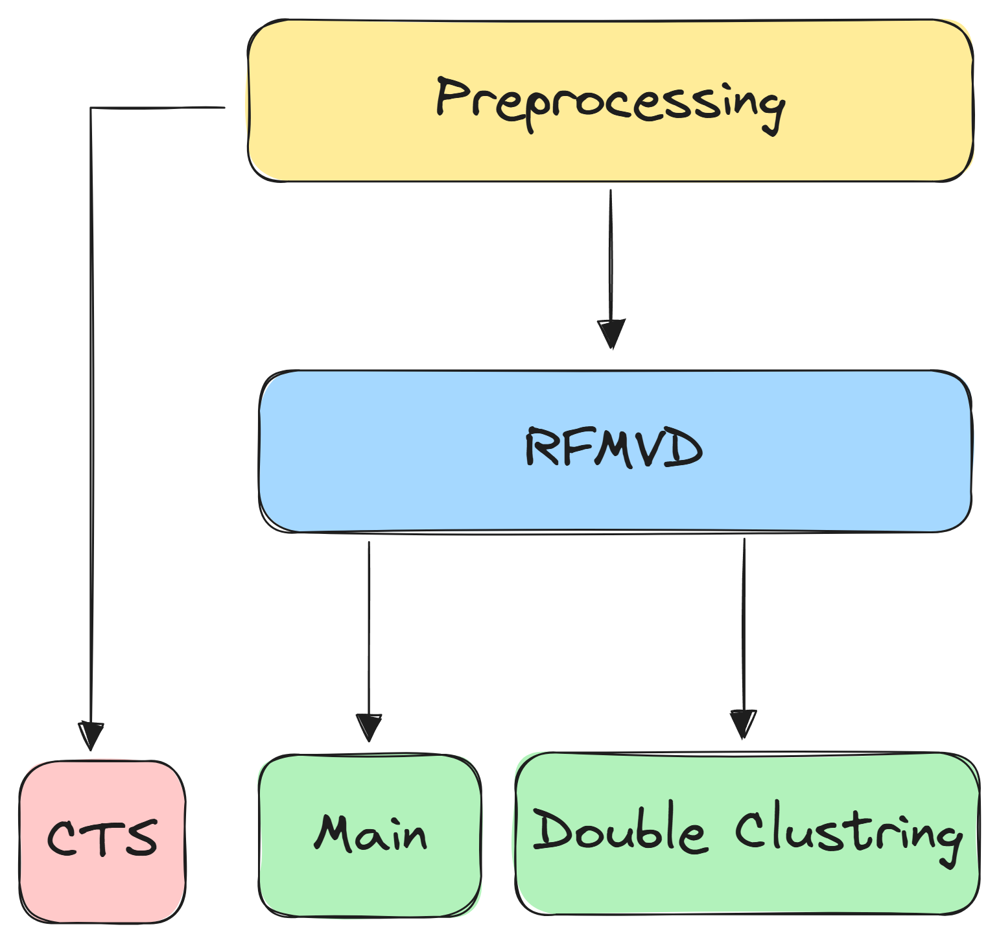

# Customer segmentation using Machine learning applied on RFMVD analysis
Traditional customer segmentation is based on the `RFM` (`Recency`, `Frequency`, and `Monetary`) score. In this paper, we introduce a novel `double-customer segmentation` method applied on `RFM-VD` (`Recency`, `Frequency`, `Monetary`, `Variety`, and `Duration`) using machine learning. This study compares K-means, hierarchical clustering, and Density-Based Spatial Clustering of Applications with Noise (DBSCAN) agianst evaluation metrics, providing valuable business insights. Additionally, we introduce a new `Customer Transition Score` `(CTS)` to evaluate the change in customer value over time for businesses numerically .
## RFMVD
`R(Recenecy):` How recently did the customer purchase?

`F(Frequency):` How often do they purchase?

`M(Monetary):` How much do they spend?

`V(Variety):` How many different products do they buy per transaction?

`D(Duration):` How much time between each two transactions?
## Data Description:

`InvoiceNo(Nominal):`  A 6-digit integral number uniquely assigned to each transaction. If this code starts with the letter 'c', it indicates a cancellation. 

`StockCode(Nominal):` Product (item) code. A 5-digit integral number uniquely assigned to each distinct product. 

`Description(String):` Product (item) name. 

`Quantity(Numeric):` The quantities of each product (item) per transaction.

`InvoiceDate(Numeric):` Invoice date and time. The day and time when a transaction was generated. 

`UnitPrice(Numeric):` Product price per unit in sterling (£). 

`CustomerID(Nominal):` A 5-digit integral number uniquely assigned to each customer. 

`Country(Nominal):` The name of the country where a customer resides.

## File Structure
To make our code more clean we grouped shared code into common files. The structure of the code as follows: 

  

## Double Customer Segmentation

## Customer Transition Score (CTS)
